- what is one to one function
  collapsed:: true
	- One to one function basically denotes the mapping of two sets. A function g is one-to-one if every element of the range of g corresponds to exactly one element of the domain of g. One-to-one is also written as 1-1 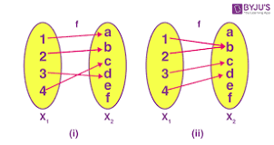{:height 277, :width 498}
	-
- how to calculate posable one to one functions between tow relations.
  collapsed:: true
	- lets find functions between 3 and 4 elements of functions
	- 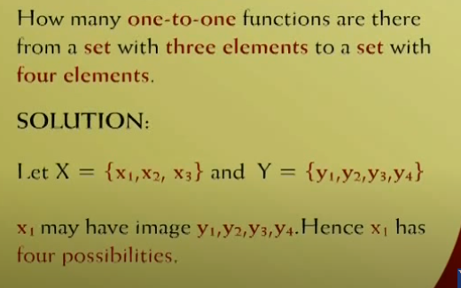
	- 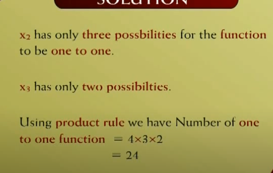
-
- how many functions between set of 3 elements to set of 2 elements 
  collapsed:: true
	- 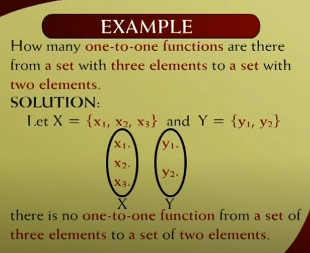
-
- Graph of one to one function
  collapsed:: true
	- 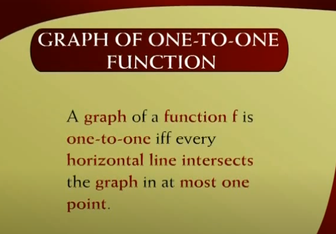
	- 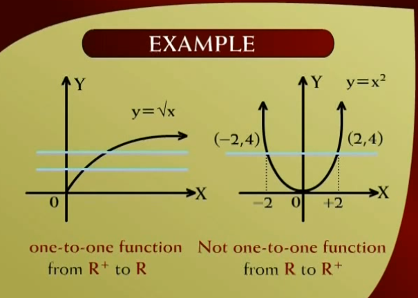
- onTo function
  collapsed:: true
	-
	- 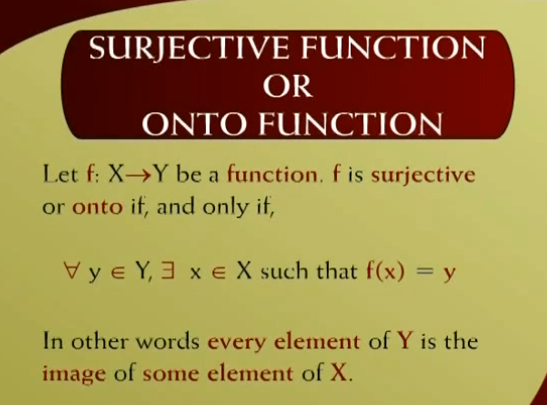
	- 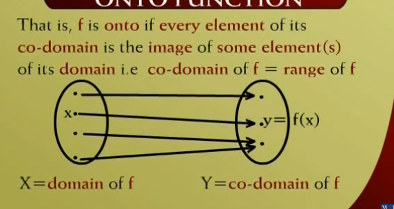
	- Example
	  collapsed:: true
		- Not surjective function
		- 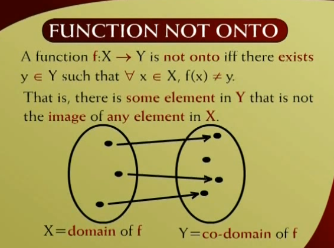
	- 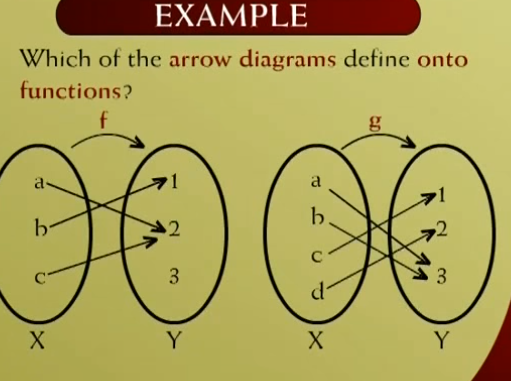
	  collapsed:: true
		- 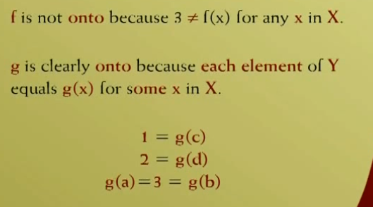
	- Equation example 
	  collapsed:: true
		- 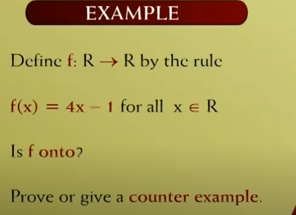
		  collapsed:: true
			- 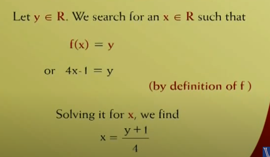
			- 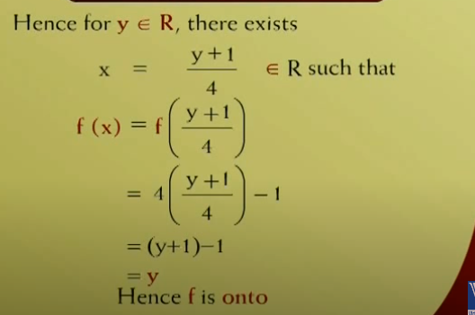
		- 2
		  collapsed:: true
			- 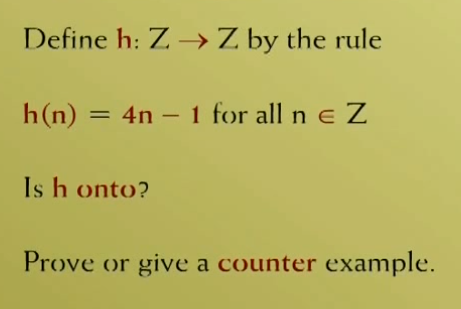
			- 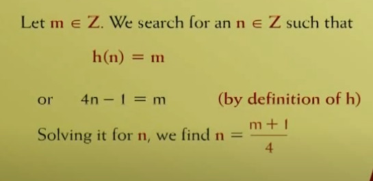
			- 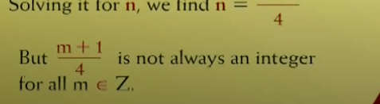
			- 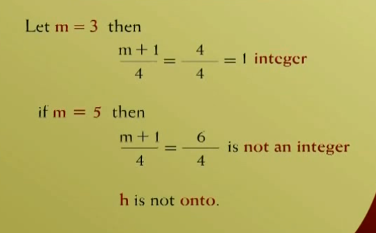
			- 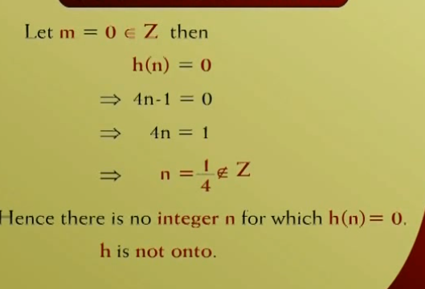
		- Graph on 
		  collapsed:: true
			- 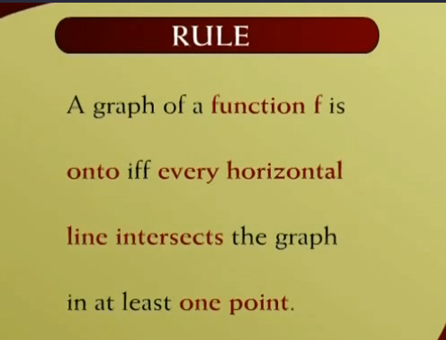
			- 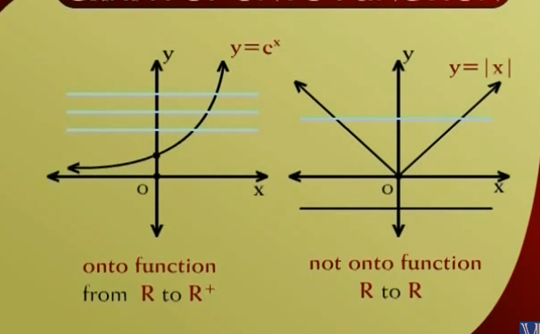
	-
	- Example of both functions
		- 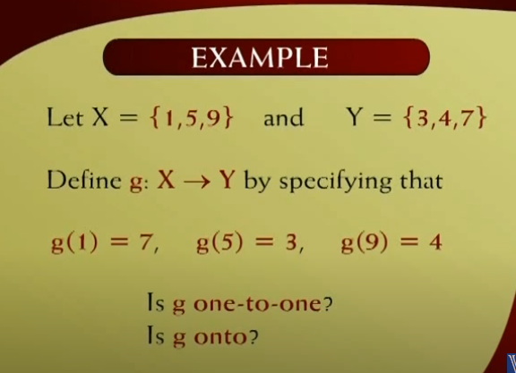
			- 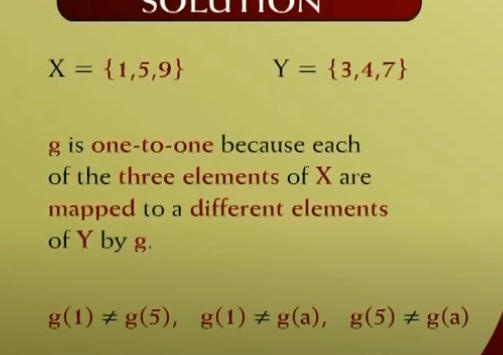
			- 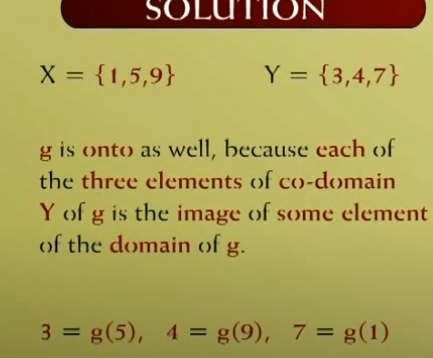
		- 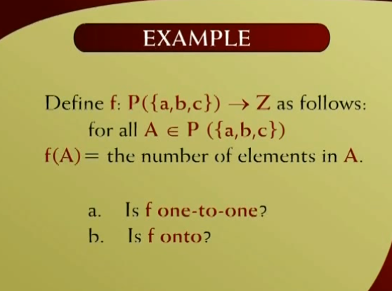
			- 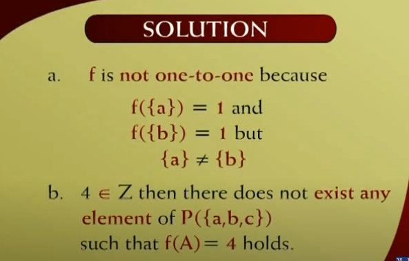
		- 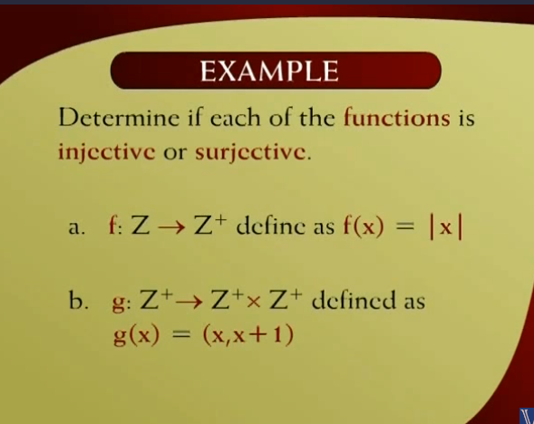
			- 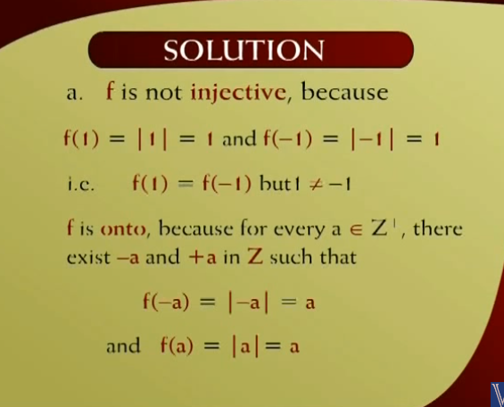
			- 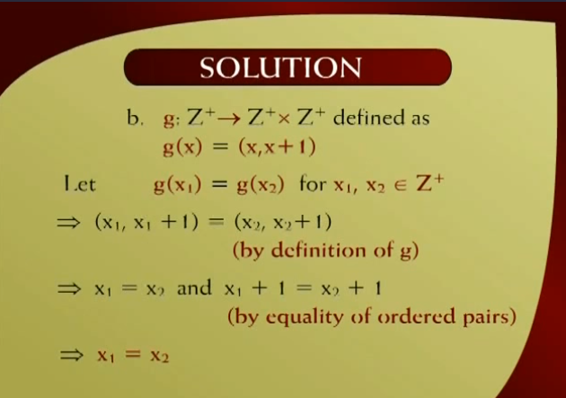  
			- 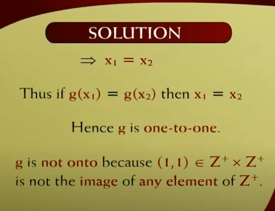
	- Bijective Function
	- 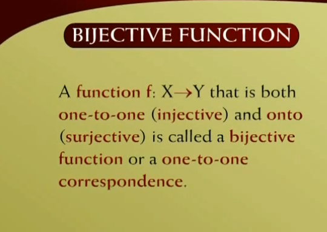
	-
-
- Example of all types of funcions
	- 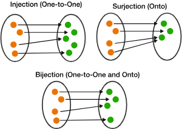
	- 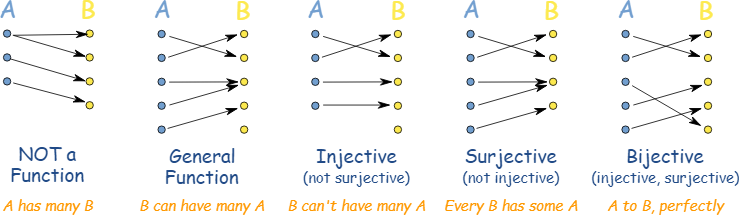
	-
-